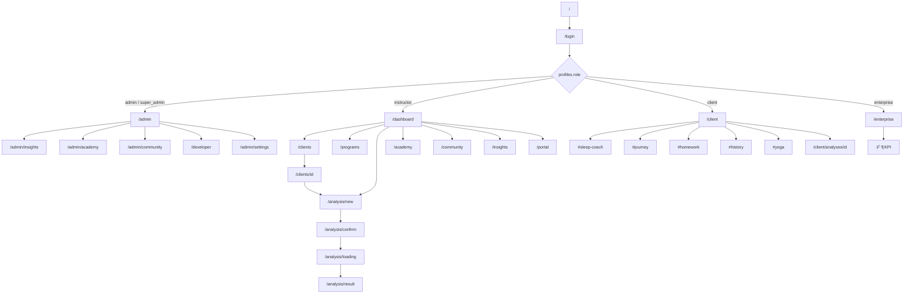

# Screen and Route Map

> 調査日: 2026-07-22  
> `app/**/page.tsx` および build 出力のルートに基づく。

## 完成状態の凡例

| 記号 | 意味 |
|---|---|
| Done | 主要フロー実装済み |
| Partial | 一部実装 / デモ混在 |
| UI | Planned パネルまたはデモ中心 |
| Public | 公開ランディング |

スマホ対応: 多くの画面が Tailwind レスポンシブ。個別 QA 未実施のため **要確認** と記す。

---

## 公開・認証

| ルート | 画面名 | Role | 目的 | 主なデータ | 主な操作 | 状態 | 遷移元 | 遷移先 | スマホ |
|---|---|---|---|---|---|---|---|---|---|
| `/` | ランディング | 全員 | ブランド紹介 | 静的 | Programs/Login へ | Public | — | `/programs`, `/login` | 要確認 |
| `/login` | ログイン | 全員 | Auth / デモ入場 | Auth | サインイン | Partial | 保護リダイレクト | Role Home | 要確認 |
| `/auth/callback` | Auth Callback | — | OAuth/確認 | session | 自動 | Done | Supabase | Home | — |
| `/setup` | スキーマセットアップ | instructor+ | DB 準備案内 | schema API | 確認 | Partial | バナー等 | dashboard | 要確認 |

---

## 管理者

| ルート | 画面名 | Role | 目的 | データ | 操作 | 状態 | 元 | 先 | スマホ |
|---|---|---|---|---|---|---|---|---|---|
| `/admin` | 管理者 Home | admin+ | KPI / OS Home | dashboard API | 閲覧 | Partial | login | 各 admin | 要確認 |
| `/admin/insights` | SWIJ Insights 管理 | admin+ | 集計 | insights | 閲覧 | Partial | admin | — | 要確認 |
| `/admin/academy` | Academy 管理 | admin+ | 資格運営 | demo/API | 閲覧 | Partial | admin | — | 要確認 |
| `/admin/community` | Community 管理 | admin+ | 運営 | community | 閲覧 | Partial | admin | — | 要確認 |
| `/admin/clients` | 全クライアント | admin+ | 一覧 | demo/API | 閲覧 | Partial | admin | — | 要確認 |
| `/admin/instructors` | 講師管理 | admin+ | 会員/クレジット | demo/platform | 調整 | Partial | admin | — | 要確認 |
| `/admin/analytics` | Analytics | admin+ | 利用状況 | demo | 閲覧 | UI | admin | — | 要確認 |
| `/admin/logs` | ログ | admin+ | 監査 | demo/API | 閲覧 | Partial | admin | — | 要確認 |
| `/admin/settings` | System 設定 | admin+ | ブランド等 | settings | 編集 | Partial | admin | — | 要確認 |
| `/developer` | Developer | admin+ | API Key 等 | demo-store | CRUD UI | UI | admin | docs/audit | 要確認 |
| `/developer/docs` | API Docs | admin+ | OpenAPI 案内 | 静的+openapi | 閲覧 | Partial | developer | — | 要確認 |
| `/developer/audit` | Audit | admin+ | 監査ログ | demo | 閲覧 | UI | developer | — | 要確認 |

---

## 認定講師

| ルート | 画面名 | Role | 目的 | データ | 操作 | 状態 | 元 | 先 | スマホ |
|---|---|---|---|---|---|---|---|---|---|
| `/dashboard` | 講師 Home | instructor | 本日業務 | appointments, homework, insight, news | 閲覧 | Done | login | clients 等 | 要確認 |
| `/portal` | マイポータル | instructor | 資格・クレジット | platform/me | 閲覧 | Done | nav | academy | 要確認 |
| `/clients` | クライアント一覧 | instructor | 管理 | clients | 一覧/新規 | Done | dashboard | detail/new | 要確認 |
| `/clients/new` | 新規クライアント | instructor | 作成 | clients | 作成 | Done | clients | detail | 要確認 |
| `/clients/[id]` | クライアント詳細 | instructor | カルテ | analyses, homework, profile | 編集/分析へ | Done | clients | analysis, profile, compare | 要確認 |
| `/clients/[id]/compare` | 比較 | instructor | 2回比較 | analyses | 閲覧 | Done | detail | — | 要確認 |
| `/clients/[id]/profile` | プロフィール入力 | instructor | 固定情報 | client_profiles | 入力 | Done | detail | confirm | 要確認 |
| `/clients/[id]/profile/confirm` | プロフィール確認 | instructor | 確認保存 | client_profiles | 保存 | Done | profile | detail | 要確認 |
| `/programs` | プログラム一覧 | instructor | 改善計画 | programs | 一覧 | Done | nav | `[clientId]` | 要確認 |
| `/programs/[clientId]` | プログラム詳細 | instructor | 編集 | programs | 更新 | Done | programs | — | 要確認 |
| `/analysis/new` | 新規分析 | instructor | OCR 開始 | images, dayContext | アップロード | Done | clients | confirm | 要確認 |
| `/analysis/confirm` | 指標確認 | instructor | OCR 確認 | metrics | 修正/確定 | Done | new | loading | 要確認 |
| `/analysis/loading` | 分析中 | instructor | AI 待ち | pending | 待機 | Done | confirm | result | 要確認 |
| `/analysis/result` | 結果 | instructor | Report/PDF | ai_result | 印刷/保存 | Partial | loading | clients | 要確認 |
| `/academy` | Academy | instructor | 学習/資格 | catalog+DB/local | 学習 | Partial | nav | learn/tests/cert | 要確認 |
| `/academy/learn/[lessonId]` | レッスン | instructor | 受講 | lesson | 進捗 | Partial | academy | — | 要確認 |
| `/academy/tests/[testId]` | 試験 | instructor | 受験 | test | 提出 | Partial | academy | — | 要確認 |
| `/academy/certificates/[id]` | 証明書 | instructor | 表示/印刷 | credential | 印刷 | Partial | academy | — | 要確認 |
| `/community` | Community | instructor+ | 議論/知識 | community | 投稿閲覧 | Partial | nav | discussions | 要確認 |
| `/community/discussions/[id]` | 議論詳細 | instructor+ | スレッド | posts | コメント | Partial | community | — | 要確認 |
| `/insights` | Insights | instructor/admin | SWI | 集計 | 閲覧 | Partial | nav | — | 要確認 |

---

## クライアント

| ルート | 画面名 | Role | 目的 | データ | 操作 | 状態 | 元 | 先 | スマホ |
|---|---|---|---|---|---|---|---|---|---|
| `/client` | クライアント Home | client | Coach/Journey/宿題等 | analyses, homeworks | チェック | Partial | login | `#` アンカー, analyses | 要確認 |
| `/client/analyses/[id]` | 分析詳細（クライアント） | client | 自分の結果 | analysis | 閲覧 | Partial | client | — | 要確認 |

---

## 企業・Planned Module

| ルート | 画面名 | Role | 目的 | データ | 操作 | 状態 | 元 | 先 | スマホ |
|---|---|---|---|---|---|---|---|---|---|
| `/enterprise` | 企業 Home | enterprise | 組織 KPI | **デモ固定** | 閲覧 | UI | login | settings | 要確認 |
| `/companies` | Companies | — | テナント構想 | Planned | — | UI | — | — | 要確認 |
| `/research` | Research | — | 研究構想 | Planned | — | UI | — | — | 要確認 |
| `/retreat` | Retreat | — | リトリート構想 | Planned | — | UI | — | — | 要確認 |
| `/events` | Events | — | イベント構想 | Planned | — | UI | — | — | 要確認 |
| `/reports` | Reports | — | レポート構想 | Planned | — | UI | — | — | 要確認 |
| `/billing` | Billing | — | 請求構想 | Planned | — | UI | — | — | 要確認 |
| `/notifications` | 通知一覧 | 各 Role | 通知 | demo/platform | 閲覧 | UI | topbar | — | 要確認 |
| `/settings` | 設定 | 各 Role | プロフィール等 | auth | 表示中心 | Partial | topbar | — | 要確認 |

---

## 主要 API ルート（画面連携）

| API | 用途 |
|---|---|
| `/api/extract` | OCR |
| `/api/analyze` | AI 分析 |
| `/api/platform/me` | プロフィール・クレジット・通知 |
| `/api/platform/credits` 等 | クレジット |
| `/api/insights`, `/api/admin/*` | Insights / Admin |
| `/api/os/search`, `/api/os/notifications` | OS Chrome |
| `/api/v1/*`, `/api/developer/*` | API Platform（デモ中心） |
| `/api/activity` | アクティビティログ |
| `/api/setup/schema` | スキーマ確認 |

---

## 画面遷移図（現行）

---

## コンポーネント概観

| 領域 | 主な場所 |
|---|---|
| ランディング | `components/Hero`, `Vision`, `About`, `Programs`, `Academy`, `Footer` 等 |
| OS Chrome | `components/os/OsShell`, `OsTopBar`, `OsNav`, `OsGlobalSearch`, `OsNotificationCenter` |
| 講師 UI | `InstructorNav`, `InstructorInsightCard`, `ClientHomeworkManager` 等 |
| クライアント UI | `SleepCoachCard`, `SleepWellnessJourneyCard`, `ClientTodayHomework` 等 |
| Design System | `design-system/*`（移行中）+ `components/ui/*` |
| Module 足場 | `modules/*/components`（Planned 含む） |
