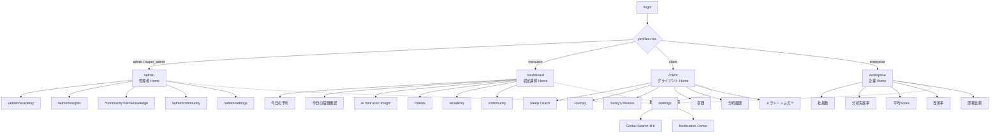

# Sleep Wellness OS 設計図

> Version 3.0 の土台設計  
> Sleep Wellness Platform → **Sleep Wellness Operating System**

---

## 1. ビジョン

Sleep Wellness Platform を、単なる睡眠分析ツールから、役割ごとに最適なホーム・検索・通知・設定を持つ **Sleep Wellness OS** へ進化させる。

| 原則 | 内容 |
|---|---|
| Role-first Home | ログイン後、ロールごとの最適 Home を表示 |
| Unified Chrome | 検索・通知・設定・ロールメニューを全画面で共有 |
| SWIJ Brand | 白ベース / ネイビーアクセント / 広い余白（Apple HIG 参考） |
| Progressive | 既存モジュール（Academy / Community / Insights 等）を OS 上に再配置 |

---

## 2. Role 一覧

| Role | DB / 型 | Home | 説明 |
|---|---|---|---|
| 管理者 | `admin` / `super_admin` | `/admin` | プラットフォーム全体の運営 |
| 認定講師 | `instructor` | `/dashboard` | セッション・クライアント指導 |
| クライアント | `client` | `/client` | 自分の睡眠ウェルネス実践 |
| 企業管理者 | `enterprise` | `/enterprise` | 組織の睡眠ウェルネス指標 |

補足:
- `super_admin` と `admin` は同じ Admin Home を共有（権限差は System 操作で表現）
- `enterprise` は v3.0 で追加（テナント実装はロードマップ）

---

## 3. 画面一覧

### 3.1 OS 共通

| 画面 | パス | 内容 |
|---|---|---|
| 全画面検索 | ⌘K / トップバー | クライアント・講師・資料・動画・ケース・イベント |
| 通知センター | トップバーパネル | 宿題期限 / 分析予定 / 認定更新 / イベント / メッセージ |
| 設定 | `/settings` | プロフィール / 通知 / セキュリティ / パスワード / 2FA（将来） / 言語（将来） |

### 3.2 管理者 Home（`/admin`）

| モジュール | 遷移先 |
|---|---|
| SWIJ Dashboard | `/admin`（KPI） |
| Academy | `/admin/academy` |
| Insights | `/admin/insights` |
| Research | `/community?tab=knowledge` |
| Community | `/admin/community` |
| System | `/admin/settings` |

### 3.3 認定講師 Home（`/dashboard`）

| モジュール | 内容 |
|---|---|
| 今日の予約 | 本日のアポイント |
| 今日の宿題確認 | 期限が近い宿題 |
| AI Instructor Insight | フォロー着眼点 |
| 担当クライアント | `/clients` |
| Academy | `/academy` |
| Community | `/community` |

### 3.4 クライアント Home（`/client`）

| モジュール | アンカー |
|---|---|
| Sleep Coach | `#sleep-coach` |
| Journey | `#journey` |
| Today's Mission | `#mission` |
| 宿題 | `#homework` |
| 分析履歴 | `#history` |
| メラトニンヨガ™ | `#yoga` |

### 3.5 企業 Home（`/enterprise`）

| モジュール | 内容 |
|---|---|
| 社員数 | KPI |
| 分析実施率 | KPI |
| 平均Score | KPI |
| 改善率 | KPI |
| 部署比較 | 部署テーブル |

### 3.6 既存フィーチャー画面（OS 上に載る）

- `/clients`, `/programs`, `/analysis/*`
- `/academy/*`, `/community/*`, `/insights`
- `/portal`, `/admin/*`

---

## 4. 画面遷移図



---

## 5. 情報アーキテクチャ（OS Chrome）

```text
┌─────────────────────────────────────────────────────────────┐
│  SWIJ Logo     [検索 ⌘K]  [通知]  [アカウント ▾ → 設定/Logout] │
├─────────────────────────────────────────────────────────────┤
│  Role Menu（ロールごとに切替）                                  │
├─────────────────────────────────────────────────────────────┤
│                                                             │
│                     Role Home / Feature                     │
│                                                             │
└─────────────────────────────────────────────────────────────┘
```

実装の中核:
- `components/os/OsTopBar.tsx` / `OsNav.tsx` / `OsGlobalSearch.tsx` / `OsNotificationCenter.tsx`
- `lib/os/navigation.ts` … ロール → メニュー / Home モジュール
- `lib/safe-redirect.ts` … ロール → Home パス

---

## 6. API / データ

| API | 用途 |
|---|---|
| `GET /api/os/search` | 全画面検索 |
| `GET /api/os/notifications` | 通知センター |
| `GET /api/platform/me` | プロフィール・既存通知 |

DB:
- `profiles.role` に `enterprise` を追加（migration `20260722270000_sleep_wellness_os_enterprise_role.sql`）

---

## 7. デザイン方針

- **参考**: Apple Human Interface Guidelines（余白・階層・一貫したナビゲーション）
- **ベース**: 白 / `#f7f7f5` サーフェス
- **アクセント**: Navy `#071426` / Gold `#8a6a2d` / Teal `#315f68`
- **角丸**: 大きめ（28px カード、2xl コントロール）
- **タイポ**: 広いトラッキングの eyebrow + 強い見出し階層

---

## 8. Version 3.0 ロードマップ

### Phase A — OS 土台（本実装）

- [x] Role-based Home（管理者 / 講師 / クライアント / 企業）
- [x] Role メニュー切替
- [x] 通知センター UI
- [x] 全画面検索
- [x] 設定画面
- [x] `enterprise` ロール型・ルーティング・デモ企業 Home

### Phase B — OS 深化

- [ ] 検索を実データ（clients / instructors / academy / community）へ接続
- [ ] 通知の既読・配信ルール・プッシュ
- [ ] 設定のサーバー永続化（プロフィール・通知プリファレンス）
- [ ] 2段階認証
- [ ] 言語設定（日 / 英）

### Phase C — 企業テナント

- [ ] 組織（org）モデルとメンバーシップ
- [ ] 企業管理者の実データ KPI（実施率・平均Score・改善率）
- [ ] 部署マスタと権限境界
- [ ] 企業向けレポート / PDF エクスポート

### Phase D — Research & OS 拡張

- [ ] Research 専用モジュール（Community knowledge から独立）
- [ ] クロスロール・アクティビティフィード
- [ ] OS ホームのウィジェットカスタマイズ

---

## 9. 主要ファイルマップ

```text
lib/os/
  roles.ts
  navigation.ts
  notifications.ts
  search.ts
  enterprise-demo.ts

components/os/
  OsShell.tsx
  OsTopBar.tsx
  OsNav.tsx
  OsGlobalSearch.tsx
  OsNotificationCenter.tsx

app/
  admin/page.tsx          # 管理者 Home
  dashboard/page.tsx      # 認定講師 Home
  client/page.tsx         # クライアント Home
  enterprise/page.tsx     # 企業 Home
  settings/page.tsx       # 設定
  api/os/search/route.ts
  api/os/notifications/route.ts

docs/
  SLEEP_WELLNESS_OS.md    # 本設計図
```

---

## 10. 成功指標（v3.0）

1. ログイン後 3 秒以内に Role Home が表示される  
2. 全認証画面から検索・通知・設定に到達できる  
3. 4 Role のメニューが混線しない（proxy / redirect で保護）  
4. SWIJ ブランド（白 × ネイビー）が OS Chrome で一貫している  
